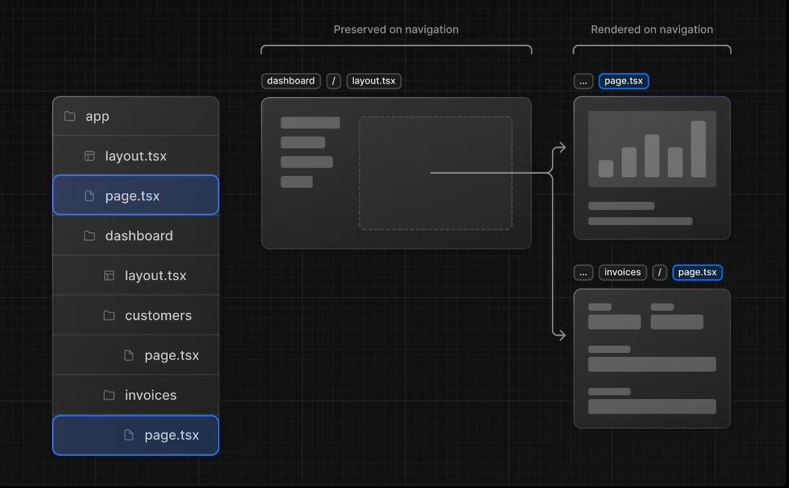
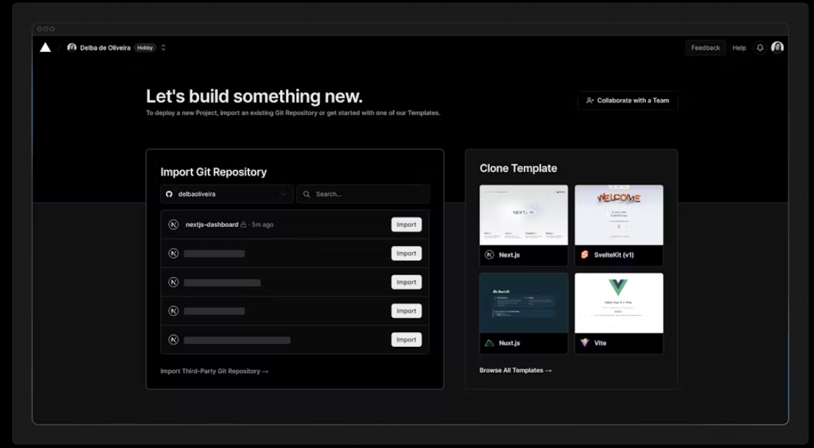
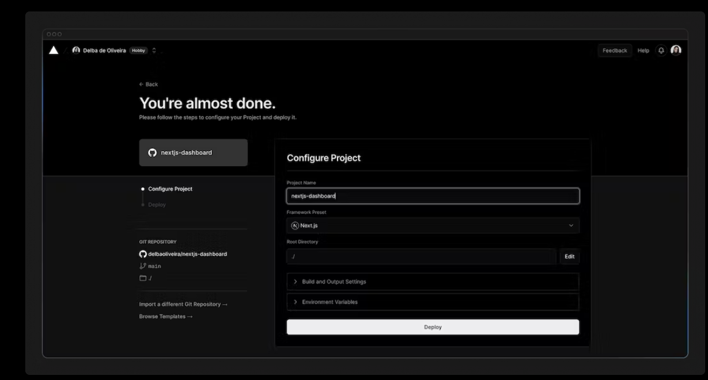
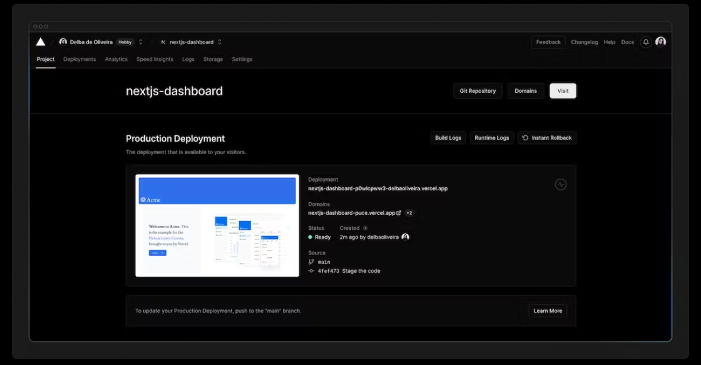
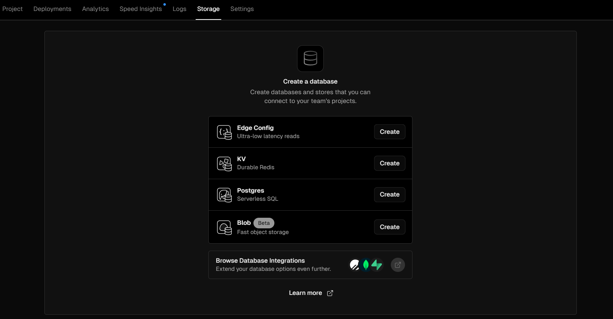
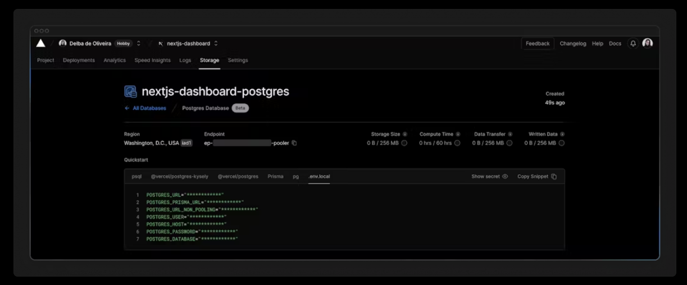
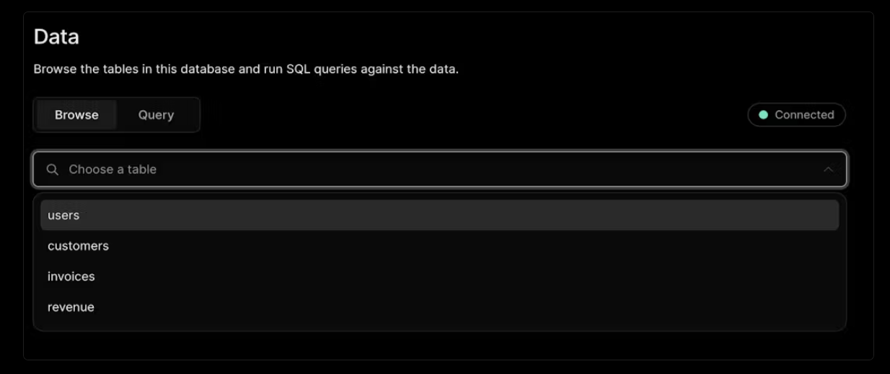
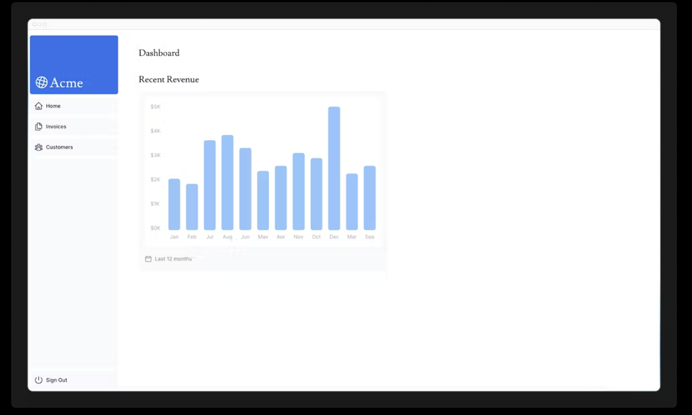
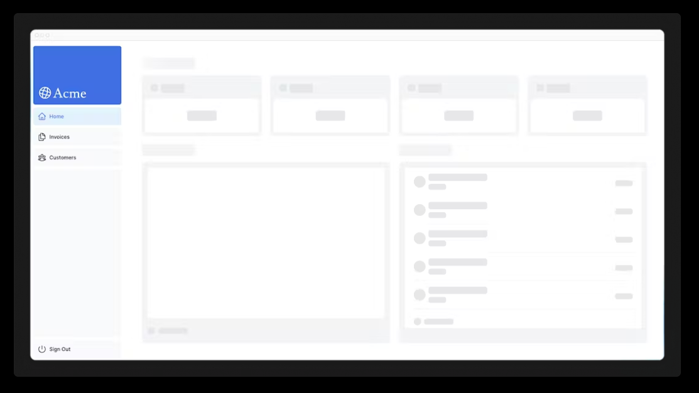
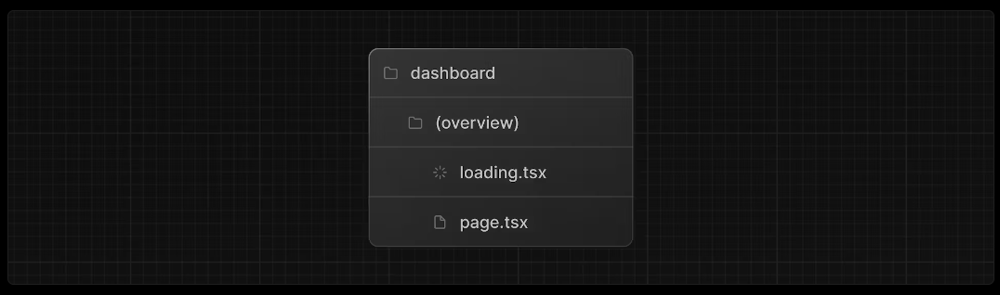

## Next.js App Router Course - Starter

This is the starter template for the Next.js App Router Course. It contains the starting code for the dashboard application.

For more information, see the [course curriculum](https://nextjs.org/learn) on the Next.js Website.

___

## 1 getting started
### 1.1. installation du projet etinstall dependencies
```bash
npx create-next-app@latest nextjs-dashboard --use-npm --example "https://github.com/vercel/next-learn/tree/main/dashboard/starter-example"
```

### 1.2 configurer typescipt avec vscode


___

## 2 css styling
### 2.1. comment ajouter un css tailwind
  voir code
### 2.2. comment ajouter un css module
  voir code
### 2.3. Using the clsx library to toggle class names
  https://github.com/lukeed/clsx

___

## 3. Optimizing Fonts and Images
### 3.1. pour mesurer l'efficacité de font
  https://web.dev/articles/cls?hl=fr

### 3.2. Adding a primary font
 - creer un fichier : /app/ui/font.ts
 - avec :

```ts
  import { Inter } from 'next/font/google';
  export const inter = Inter({ subsets: ['latin'] });
```

 - Finally, add the font to the <body> element in /app/layout.tsx:

  la classe : className={`${inter.className} antialiased`}

```{.typescript .numberLines .lineAnchors highlight=[2,11]} 
  import '@/app/ui/global.css';
  import { inter } from '@/app/ui/fonts' 
  
  export default function RootLayout({
    children,
  }: {
    children: React.ReactNode;// nouveau
  }) {
    return (
      <html lang="en">
        <body className={`${inter.className} antialiased`}>{children}</body>  // nouveau
      </html>
    );
  }

```


### 3.2. Adding a secondary font
 - voir les codes
 - comment faire :
https://nextjs.org/docs/app/building-your-application/optimizing/fonts#using-multiple-fonts

 - liste des toutes les options
https://nextjs.org/docs/app/api-reference/components/font#font-function-arguments


### 3.3 Optimizing Images

> /app/page.tsx
```{.typescript .numberLines .lineAnchors highlight=[5,12-18]} 

  import AcmeLogo from '@/app/ui/acme-logo';
  import { ArrowRightIcon } from '@heroicons/react/24/outline';
  import Link from 'next/link';
  import { lusitana } from '@/app/ui/fonts';
  import Image from 'next/image';
  
  export default function Page() {
    return (
      // ...
      <div className="flex items-center justify-center p-6 md:w-3/5 md:px-28 md:py-12">
        {/* Add Hero Images Here */}
        <Image
          src="/hero-desktop.png"
          width={1000}
          height={760}
          className="hidden md:block"
          alt="Screenshots of the dashboard project showing desktop version"
        />
      </div>
      //...
    );
  }

```

### 3.4 Lecture 
  - Image Optimization Docs : https://nextjs.org/docs/app/building-your-application/optimizing/images
  - Font Optimization Docs : https://nextjs.org/docs/app/building-your-application/optimizing/fonts
  - Improving Web Performance with Images (MDN) : https://developer.mozilla.org/en-US/docs/Learn/Performance/Multimedia
  - Web Fonts (MDN) : https://developer.mozilla.org/en-US/docs/Learn/CSS/Styling_text/Web_fonts


___

## 4. Creating Layouts and Pages

### a. Creating the dashboard page
Create a new folder called dashboard inside /app. Then, create a new page.tsx file inside the dashboard folder with the following content:


> /app/dashboard/page.tsx
```{.typescript .numberLines .lineAnchors highlight=[5,12-18]} 

  export default function Page() {
    return <p>Dashboard Page</p>;
  }

```

### b. ensuite on peut visiter le lien
> http://localhost:3000/dashboard

This is how you can create different pages in Next.js: create a new route segment using a folder, and add a page file inside it.


By having a special name for page files, Next.js allows you to colocate UI components, test files, and other related code with your routes. Only the content inside the page file will be publicly accessible. For example, the /ui and /lib folders are colocated inside the /app folder along with your routes.

### c.  Creating the dashboard pages
Let's practice creating more routes. In your dashboard, create two more pages:

Customers Page: The page should be accessible on http://localhost:3000/dashboard/customers. For now, it should return a `<p>Customers Page</p>` element.
Invoices Page: The invoices page should be accessible on http://localhost:3000/dashboard/invoices. For now, also return a `<p>Invoices Page</p> `element.


### d. Creating the dashboard layout
Dashboards have some sort of navigation that is shared across multiple pages. In Next.js, you can use a special layout.tsx file to create UI that is shared between multiple pages. Let's create a layout for the dashboard pages!

Inside the /dashboard folder, add a new file called layout.tsx and paste the following code:


> /app/dashboard/layout.tsx
```{.typescript .numberLines .lineAnchors } 

import SideNav from '@/app/ui/dashboard/sidenav';
 
export default function Layout({ children }: { children: React.ReactNode }) {
  return (
    <div className="flex h-screen flex-col md:flex-row md:overflow-hidden">
      <div className="w-full flex-none md:w-64">
        <SideNav />
      </div>
      <div className="flex-grow p-6 md:overflow-y-auto md:p-12">{children}</div>
    </div>
  );
}

```


One benefit of using layouts in Next.js is that on navigation, only the page components update while the layout won't re-render. This is called partial rendering:




## 5. Navigating Between Pages


### a. The <Link> component


> /app/ui/dashboard/nav-links.tsx
```{.typescript .numberLines .lineAnchors highlight=[7, 17, 24]} 


import {
  UserGroupIcon,
  HomeIcon,
  DocumentDuplicateIcon,
} from '@heroicons/react/24/outline';
import Link from 'next/link';
 
// ...
 
export default function NavLinks() {
  return (
    <>
      {links.map((link) => {
        const LinkIcon = link.icon;
        return (
          <Link
            key={link.name}
            href={link.href}
            className="flex h-[48px] grow items-center justify-center gap-2 rounded-md bg-gray-50 p-3 text-sm font-medium hover:bg-sky-100 hover:text-blue-600 md:flex-none md:justify-start md:p-2 md:px-3"
          >
            <LinkIcon className="w-6" />
            <p className="hidden md:block">{link.name}</p>
          </Link>
        );
      })}
    </>
  );
}


```

### b. Pattern: Showing active links

A common UI pattern is to show an active link to indicate to the user what page they are currently on. To do this, you need to get the user's current path from the URL. Next.js provides a hook called usePathname() that you can use to check the path and implement this pattern.

Since ``usePathname()`` is a hook, you'll need to turn nav-links.tsx into a Client Component. Add React's `"use client"` directive to the top of the file, then import ```usePathname()``` from next/navigation:


> /app/ui/dashboard/nav-links.tsx
```{.typescript .numberLines .lineAnchors highlight=[1, 8]} 

'use client';
 
import {
  UserGroupIcon,
  HomeIcon,
  InboxIcon,
} from '@heroicons/react/24/outline';
import Link from 'next/link';
import { usePathname } from 'next/navigation';
 
// ...

```

Next, assign the path to a variable called pathname inside your <NavLinks /> component:


> /app/ui/dashboard/nav-links.tsx
```{.typescript .numberLines .lineAnchors highlight=[2]} 

export default function NavLinks() {
  const pathname = usePathname();
  // ...
}
```

You can use the clsx library introduced in the chapter on CSS styling to conditionally apply class names when the link is active. When link.href matches the pathname, the link should displayed with blue text and a light blue background.

Here's the final code for nav-links.tsx:

> /app/ui/dashboard/nav-links.tsx
```{.typescript .numberLines .lineAnchors highlight=[10, 25-30]} 

'use client';
 
import {
  UserGroupIcon,
  HomeIcon,
  DocumentDuplicateIcon,
} from '@heroicons/react/24/outline';
import Link from 'next/link';
import { usePathname } from 'next/navigation';
import clsx from 'clsx';
 
// ...
 
export default function NavLinks() {
  const pathname = usePathname();
 
  return (
    <>
      {links.map((link) => {
        const LinkIcon = link.icon;
        return (
          <Link
            key={link.name}
            href={link.href}
            className={clsx(
              'flex h-[48px] grow items-center justify-center gap-2 rounded-md bg-gray-50 p-3 text-sm font-medium hover:bg-sky-100 hover:text-blue-600 md:flex-none md:justify-start md:p-2 md:px-3',
              {
                'bg-sky-100 text-blue-600': pathname === link.href,
              },
            )}
          >
            <LinkIcon className="w-6" />
            <p className="hidden md:block">{link.name}</p>
          </Link>
        );
      })}
    </>
  );
}

```

Save and check your localhost. You should now see the active link highlighted in blue.

___

## 6. Setting Up Your Database

Before you can continue working on your dashboard, you'll need some data. In this chapter, you'll be setting up a PostgreSQL database using @vercel/postgres.

### a. Create a GitHub repository
To start, let's push your repository to Github if you haven't done so already. This will make it easier to set up your database and deploy.

### b. Create a Vercel account

### c. Connect and deploy your project

Next, you'll be taken to this screen where you can select and import the GitHub repository you've just created:


Name your project and click Deploy.


Hooray! 🎉 Your project is now deployed.


By connecting your GitHub repository, whenever you push changes to your main branch, Vercel will automatically redeploy your application with no configuration needed. When opening pull requests, you'll also have instant previews which allow you to catch deployment errors early and share a preview of your project with team members for feedback.


### d. Create a Postgres database
Next, to set up a database, click Continue to Dashboard and select the Storage tab from your project dashboard. Select Connect Store → Create New → Postgres → Continue.



Once connected, navigate to the .env.local tab, click Show secret and Copy Snippet. Make sure you reveal the secrets before copying them.



Navigate to your code editor and rename the .env.example file to .env. Paste in the copied contents from Vercel.

Important: Go to your .gitignore file and make sure .env is in the ignored files to prevent your database secrets from being exposed when you push to GitHub.

Finally, run 
```cmd
npm i @vercel/postgres 
```

in your terminal to install the Vercel Postgres SDK.


### e. Seed your database

Now that your database has been created, let's seed it with some initial data. This will allow you to have some data to work with as you build the dashboard.

In the /scripts folder of your project, there's a file called seed.js. This script contains the instructions for creating and seeding the invoices, customers, user, revenue tables.

Don't worry if you don't understand everything the code is doing, but to give you an overview, the script uses SQL to create the tables, and the data from placeholder-data.js file to populate them after they've been created.

Next, in your package.json file, add the following line to your scripts:


> /package.json
```{.typescript .numberLines .lineAnchors highlight=[5]} 
"scripts": {
  "build": "next build",
  "dev": "next dev",
  "start": "next start",
  "seed": "node -r dotenv/config ./scripts/seed.js"
},


```

puis,

Now, run npm run seed. You should see some console.log messages in your terminal to let you know the script is running.

```cmd
npm run seed
```

### f. Exploring your database
Let's see what your database looks like. Go back to Vercel, and click Data on the sidenav.

In this section, you'll find the four new tables: users, customers, invoices, and revenue.



### g. Executing queries
You can switch to the "query" tab to interact with your database. This section supports standard SQL commands. For instance, inputting DROP TABLE customers will delete "customers" table along with all its data - so be careful!

Let's run your first database query. Paste and run the following SQL code into the Vercel interface:

```sql
SELECT invoices.amount, customers.name
FROM invoices
JOIN customers ON invoices.customer_id = customers.id
WHERE invoices.amount = 666;
```


## 7. Fetching Data

### a. Choosing how to fetch data
API layer
APIs are an intermediary layer between your application code and database. There are a few cases where you might use an API:

If you're using 3rd party services that provide an API.
If you're fetching data from the client, you want to have an API layer that runs on the server to avoid exposing your database secrets to the client.
In Next.js, you can create API endpoints using Route Handlers.

Database queries
When you're creating a full-stack application, you'll also need to write logic to interact with your database. For relational databases like Postgres, you can do this with SQL, or an ORM like Prisma.

There are a few cases where you have to write database queries:

When creating your API endpoints, you need to write logic to interact with your database.
If you are using React Server Components (fetching data on the server), you can skip the API layer, and query your database directly without risking exposing your database secrets to the client.

### b. Using Server Components to fetch data
By default, Next.js applications use React Server Components. Fetching data with Server Components is a relatively new approach and there are a few benefits of using them:
Server Components support promises, providing a simpler solution for asynchronous tasks like data fetching. You can use async/await syntax without reaching out for useEffect, useState or data fetching libraries.
Server Components execute on the server, so you can keep expensive data fetches and logic on the server and only send the result to the client.
As mentioned before, since Server Components execute on the server, you can query the database directly without an additional API layer.

### c. Using SQL
For your dashboard project, you'll write database queries using the Vercel Postgres SDK and SQL. There are a few reasons why we'll be using SQL:

SQL is the industry standard for querying relational databases (e.g. ORMs generate SQL under the hood).
Having a basic understanding of SQL can help you understand the fundamentals of relational databases, allowing you to apply your knowledge to other tools.
SQL is versatile, allowing you to fetch and manipulate specific data.
The Vercel Postgres SDK provides protection against SQL injections.
Don't worry if you haven't used SQL before - we have provided the queries for you.

Go to /app/lib/data.ts, here you'll see that we're importing the sql function from @vercel/postgres. This function allows you to query your database:

> /app/lib/data.ts
```{.typescript .numberLines .lineAnchors highlight=[1]} 
import { sql } from '@vercel/postgres';
 
// ...

```


### d. Fetching data for the dashboard overview page
Now that you understand different ways of fetching data, let's fetch data for the dashboard overview page. Navigate to /app/dashboard/page.tsx, paste the following code, and spend some time exploring it:


> /app/dashboard/page.tsx
```{.typescript .numberLines .lineAnchors highlight=[]} 

import { Card } from '@/app/ui/dashboard/cards';
import RevenueChart from '@/app/ui/dashboard/revenue-chart';
import LatestInvoices from '@/app/ui/dashboard/latest-invoices';
import { lusitana } from '@/app/ui/fonts';
 
export default async function Page() {
  return (
    <main>
      <h1 className={`${lusitana.className} mb-4 text-xl md:text-2xl`}>
        Dashboard
      </h1>
      <div className="grid gap-6 sm:grid-cols-2 lg:grid-cols-4">
        {/* <Card title="Collected" value={totalPaidInvoices} type="collected" /> */}
        {/* <Card title="Pending" value={totalPendingInvoices} type="pending" /> */}
        {/* <Card title="Total Invoices" value={numberOfInvoices} type="invoices" /> */}
        {/* <Card
          title="Total Customers"
          value={numberOfCustomers}
          type="customers"
        /> */}
      </div>
      <div className="mt-6 grid grid-cols-1 gap-6 md:grid-cols-4 lg:grid-cols-8">
        {/* <RevenueChart revenue={revenue}  /> */}
        {/* <LatestInvoices latestInvoices={latestInvoices} /> */}
      </div>
    </main>
  );
}

```

In the code above:

Page is an async component. This allows you to use await to fetch data.
There are also 3 components which receive data: <Card>, <RevenueChart>, and <LatestInvoices>. They are currently commented out to prevent the application from erroring.

### e. Fetching data for <RevenueChart/>

To fetch data for the <RevenueChart/> component, import the fetchRevenue function from data.ts and call it inside your component:


> /app/dashboard/page.tsx
```{.typescript .numberLines .lineAnchors highlight=[5, 8, 26]} 

import { Card } from '@/app/ui/dashboard/cards';
import RevenueChart from '@/app/ui/dashboard/revenue-chart';
import LatestInvoices from '@/app/ui/dashboard/latest-invoices';
import { lusitana } from '@/app/ui/fonts';
import { fetchRevenue } from '@/app/lib/data';
 
export default async function Page() {
  const revenue = await fetchRevenue();

  return (
    <main>
      <h1 className={`${lusitana.className} mb-4 text-xl md:text-2xl`}>
        Dashboard
      </h1>
      <div className="grid gap-6 sm:grid-cols-2 lg:grid-cols-4">
        {/* <Card title="Collected" value={totalPaidInvoices} type="collected" /> */}
        {/* <Card title="Pending" value={totalPendingInvoices} type="pending" /> */}
        {/* <Card title="Total Invoices" value={numberOfInvoices} type="invoices" /> */}
        {/* <Card
          title="Total Customers"
          value={numberOfCustomers}
          type="customers"
        /> */}
      </div>
      <div className="mt-6 grid grid-cols-1 gap-6 md:grid-cols-4 lg:grid-cols-8">
        <RevenueChart revenue={revenue}  />
        {/* <LatestInvoices latestInvoices={latestInvoices} /> */}
      </div>
    </main>
  )

}

```

Then, uncomment the <RevenueChart/> component, navigate to the component file (/app/ui/dashboard/revenue-chart.tsx) and uncomment the code inside it. Check your localhost, you should be able to see a chart that uses revenue data.



### f. Fetching data for <LatestInvoices/>
For the <LatestInvoices /> component, we need to get the latest 5 invoices, sorted by date.

You could fetch all the invoices and sort through them using JavaScript. This isn't a problem as our data is small, but as your application grows, it can significantly increase the amount of data transferred on each request and the JavaScript required to sort through it.

Instead of sorting through the latest invoices in-memory, you can use an SQL query to fetch only the last 5 invoices. For example, this is the SQL query from your data.ts file:


## 8. static && dynamic rendering 

### a. What is Static Rendering?
With static rendering, data fetching and rendering happens on the server at build time (when you deploy) or during revalidation. The result can then be distributed and cached in a Content Delivery Network (CDN).

### b. What is Dynamic Rendering?
With dynamic rendering, content is rendered on the server for each user at request time (when the user visits the page). There are a couple of benefits of dynamic rendering:

Real-Time Data - Dynamic rendering allows your application to display real-time or frequently updated data. This is ideal for applications where data changes often.
User-Specific Content - It's easier to serve personalized content, such as dashboards or user profiles, and update the data based on user interaction.
Request Time Information - Dynamic rendering allows you to access information that can only be known at request time, such as cookies or the URL search parameters.


## 9. straming

### a. What is streaming?
Streaming is a data transfer technique that allows you to break down a route into smaller "chunks" and progressively stream them from the server to the client as they become ready.

By streaming, you can prevent slow data requests from blocking your whole page. This allows the user to see and interact with parts of the page without waiting for all the data to load before any UI can be shown to the user.

Streaming works well with React's component model, as each component can be considered a chunk.

There are two ways you implement streaming in Next.js:

- At the page level, with the loading.tsx file.
- For specific components, with <Suspense>.
Let's see how this works.


### b. Streaming a whole page with loading.tsx
In the /app/dashboard folder, create a new file called loading.tsx:


> /app/dashboard/loading.tsx
```{.typescript .numberLines .lineAnchors highlight=[1-3]} 

export default function Loading() {
  return <div>Loading...</div>;
}

```

### c. Adding loading skeletons
A loading skeleton is a simplified version of the UI. Many websites use them as a placeholder (or fallback) to indicate to users that the content is loading. Any UI you embed into loading.tsx will be embedded as part of the static file, and sent first. Then, the rest of the dynamic content will be streamed from the server to the client.

Inside your loading.tsx file, import a new component called <DashboardSkeleton>:


> /app/dashboard/loading.tsx
```{.typescript .numberLines .lineAnchors highlight=[1, 4]} 

import DashboardSkeleton from '@/app/ui/skeletons';
 
export default function Loading() {
  return <DashboardSkeleton />;
}

```

Then, refresh http://localhost:3000/dashboard, and you should now see:




### d. Fixing the loading skeleton bug with route groups
Right now, your loading skeleton will apply to the invoices and customers pages as well.

Since loading.tsx is a level higher than /invoices/page.tsx and /customers/page.tsx in the file system, it's also applied to those pages.

We can change this with Route Groups. Create a new folder called /(overview) inside the dashboard folder. Then, move your loading.tsx and page.tsx files inside the folder:



## 10. partial prerendering


## 11. Adding Search and Pagination


***


# Autre ressources
## pour markdown syntaxe
https://shd101wyy.github.io/markdown-preview-enhanced/#/markdown-basics?id=line-numbers
https://www.markdownguide.org/basic-syntax/

## astuce et raccourcis clavier markdown
https://thinkr.fr/r-markdown-les-petits-trucs-qui-changent-la-vie/


# lien de mon site
https://nextjs14-official-tuto.vercel.app/
