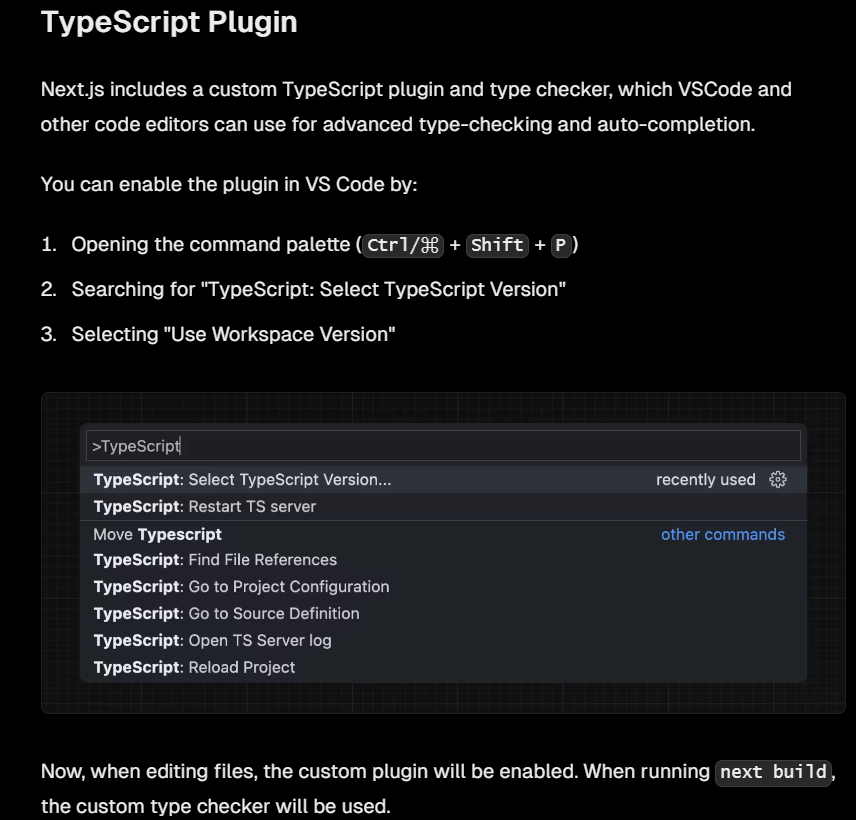

## Next.js App Router Course - Starter

This is the starter template for the Next.js App Router Course. It contains the starting code for the dashboard application.

For more information, see the [course curriculum](https://nextjs.org/learn) on the Next.js Website.

## 1 getting started
### 1.1. installation du projet etinstall dependencies
```bash
npx create-next-app@latest nextjs-dashboard --use-npm --example "https://github.com/vercel/next-learn/tree/main/dashboard/starter-example"
```

### 1.2 configurer typescipt avec vscode




## 2 css styling
### 2.1. comment ajouter un css tailwind

### 2.2. comment ajouter un css module


